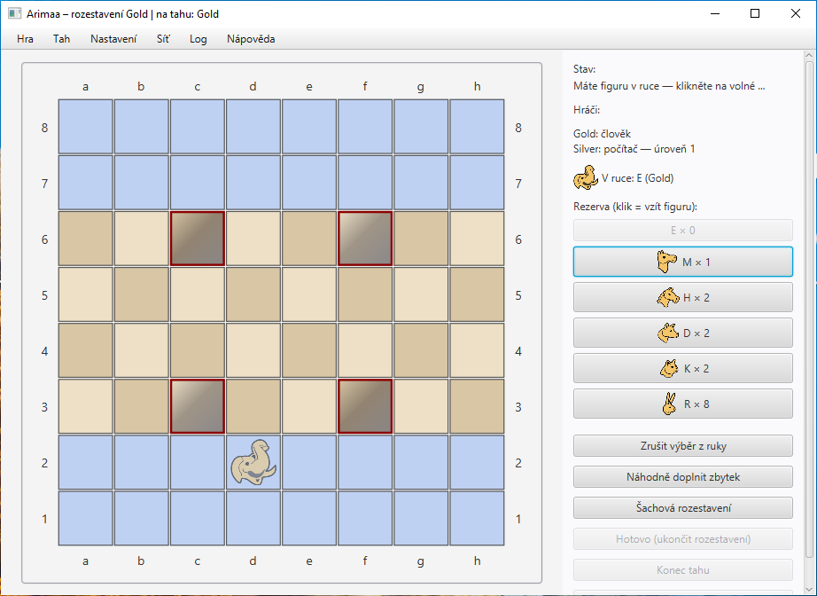
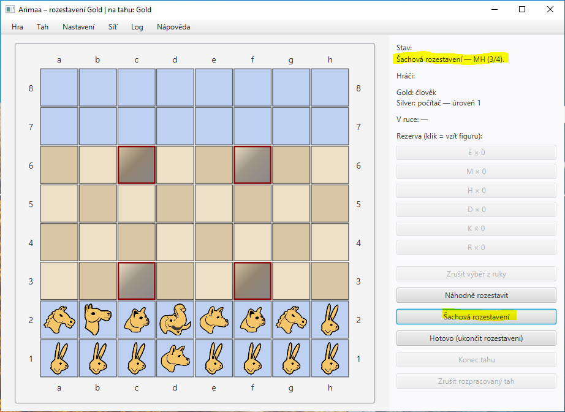
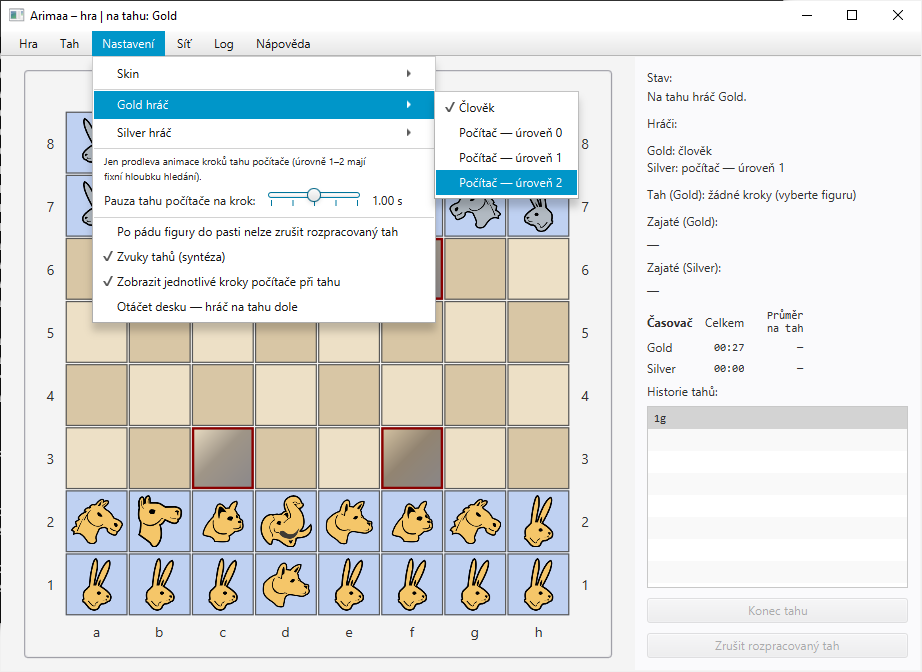
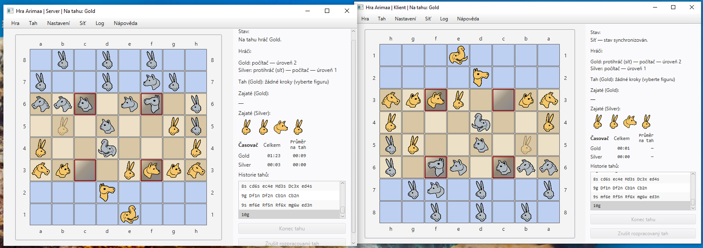

# Uživatelský manuál — Arimaa (semestrální aplikace)

Tento dokument popisuje aplikaci studentské varianty hry **Arimaa** — pravidla v obecné rovině, ovládání v naší implementaci, spuštění na různých systémech a hra po síti.

**Oficiální zadání tématu** (FEL ČVUT, B0B36PJV): [Arimaa — semestrální práce](https://cw.fel.cvut.cz/wiki/courses/b0b36pjv/semestral/arima).

---

## 1. Co budete potřebovat

| Požadavek | Poznámka |
|-----------|----------|
| **Java** | minimálně **21** (dle zadání kurzu) |
| **Maven** | 3.x — ke kompilaci a spuštění přes profil OpenJFX |
| **Síť (volitelně)** | pro hru dvou lidí přes TCP — otevřený port na počítači hostitele (firewall/router) |

Herní figurky v aplikaci používají obrázky z modulu, např. sada `default` (png):

- příklad souboru v repositáři:  (výchozí téma, „Jumbo“ = slon)

---

## 2. Spuštění aplikace

Pracovní adresář předpokládáme **kořen klonovaného repositáře** (kde leží `README.md` a složka `Arimaa/`).

### 2.1 Windows, Linux, macOS — přes Maven (doporučeno)

```bash
cd /cesta/k/sem
mvn -f Arimaa/pom.xml compile
mvn -f Arimaa/pom.xml javafx:run
```

**Hlavní třída:** `cz.cvut.fel.pjv.arimaa.ArimaaApp`

**Logování (volitelné):**

- argumenty: `--log-level=INFO` nebo `--log-file=cesta/arimaa.log`
- nebo JVM: `-Dcz.cvut.fel.pjv.arimaa.log.level=DEBUG`
- úroveň logů lze měnit i **za běhu** v menu **Log → Logback Level**, zápis do souboru v menu **Log → Zapisovat do souboru**.

### 2.2 Linux / macOS — poznámky

- Ujistěte se, že `java` a `mvn` v `PATH` odpovídají JDK 21.
- OpenJFX stáhne Maven jako závislosti; při problémech s nativními knihovnami sestavujte a spouštějte na stejném OS, na kterém distribuci chcete používat (zejména „fat“ JAR ze shade pluginu).

### 2.3 Spuštění z IDE

**Main class:** `cz.cvut.fel.pjv.arimaa.ArimaaApp`  
**Program arguments:** např. `--log-level=INFO`  
**VM options:** např. `-Dcz.cvut.fel.pjv.arimaa.log.level=DEBUG`

---

## 3. Pravidla hry (stručně)

Cílem je dostat **králíka** (v aplikaci jde o typ figurky „Hare“ / králík) na **poslední řádek soupeře**.

- **Fáze SETUP:** střídavé rozestavení figurek na svou domovskou řadu dle kapacity a typů; potvrzení rozestavení.
- **Fáze PLAY:** každý tah obsahuje **1–4 ortogonální kroky**; silnější figury mohou slabší **tlačit** nebo **tahat**.
- **Pasti:** označená pole — figura na pasti bez vlastního souseda ortogonálně **zmizí**.
- **Konec hry:** mimo cíle s králíkem též blokace soupeře dle pravidel Arimaa.

**Úplné oficiální znění** pravidel nepopisuje tato aplikace — použijte odkazy ze stránky kurzu nebo zdroje komunity ([zadání Arimaa](https://cw.fel.cvut.cz/wiki/courses/b0b36pjv/semestral/arima)).

---

## 4. Jak začít — rozestavení (SETUP)

Po spuštění aplikace jste ve fázi **rozestavení**. Začíná **Gold** (která strana je „dole“ na obrazovce závisí na položce **Nastavení → Otáčet desku — hráč na tahu dole** a případně na síťové hře — viz nápověda v aplikaci).

**Ruční rozestavení:** v postranním panelu klikněte na **typ figurky v rezervě** (kolík u tlačítka ukazuje, kolik jich ještě máte). Pak klikněte na **volné pole na své domovské řadě** (pro Gold spodní dvě řady desky v základní orientaci, pro Silver horní dvě). Máte-li figurku „v ruce“ a pole se vám nelíbí, klikněte znovu na stejný typ v rezervě a výběr se zruší. **Klik na vlastní figurku na domovském poli** ji vrátí do rezervy.



**Tlačítko „Náhodně …“** (nebo **mezerník**, když jste na tahu vy a ne počítač):  

- ještě nemáte všechny figurky na desce → **doplní zbytek náhodně** na domovské řady (musí to jít pravidly kapacit);  
- už máte všech šestnáct na domovských řadách → **přehází je náhodně** mezi políčky na těchto řadách.

**„Šachová rozestavení“** (tlačítko nebo **Ctrl+mezerník**): nejde o jednu šablonu z šachovnice, ale o **čtyři pevné oficiální rozložení** (stejný počet figurek každého typu jako v pravidlech Arimaa), které aplikace bere z dokumentovaných diagramů (viz kód `SetupPresets`). Při každém stisku se použije **další varianta v cyklu** (po čtvrté zase první; po **Nové hře** se cyklus resetuje). Ve stavovém řádku uvidíte krátký popis a „1/4“ až „4/4“:

1. **opačné šachy** — silné figury v zadní řadě v opačném pořadí než v běžné „šachové“ mapě;  

2. **symetrické** — u **Gold** rozložení ve stylu diagramu *99of9*; u **Silver** u stejného kroku v cyklu jiné pojmenované rozložení (*Fritzlein*), aby seděl multiset;  

3. **MH** a **4. HH** — další pojmenované diagramy z materiálů k rozestavení (Gold má vlastní vzory, Silver odpovídající zrcadlení / výjimka u indexu 1).

   

**Hotovo** potvrzuje rozestavení strany na tahu (**Ctrl+Enter** totéž). Druhá strana pak pokračuje stejně. V této fázi aplikace **Enter bez Ctrl** jako zkratku pro dokončení nepoužívá — spolehněte se na **Hotovo**, **Ctrl+Enter** nebo přehled v §6.

**Počítač** při rozestavení vezme **šest** možností, jak zaplnit domovské řady: **klasické rozložení ve stylu šachovnice** (sloni do rohů, osm králíků vpřed), **čtyři střídající se varianty** z toho samého souboru, na který odkazuje tlačítko „Šachová rozestavení“, a **jedno čistě náhodné** rozházení figurek z panelu na volná domovská pole (stejná myšlenka jako u náhodného doplnění u člověka, jen bez předlohy). Těchto **šest možností** si **náhodně promíchá**, pak je v tomto pořadí **zkouší jednu po druhé** a použije **první, která vyjde**.

**Nastavení (menu):** u **Gold hráč** a **Silver hráč** volíte **člověka**, **počítač (úroveň 0–2)** nebo u síťové hry příslušného **protihráče ze sítě**. Dva lidé na jednom PC: obě strany **člověk**. 

Ve výchozím nastavení stříbrný soupeř má úroveň 1 složitosti, **pro demonstraci samostatné hry** stačí si vybrat kterýkoliv z počítačových úrovní složitostí u zlatého hráče — počítačové hráči si rozestaví figurky a projdou hru do vítěze jednoho z nich.  



Přestože úroveň 2 byla myšlená coby 'chytřejší' varianta než 1, ve výsledku jsou si sobě rovné a první úroveň rovněž často vyhrává. Po začátku hry můžete kdykoliv přepnout do ručního ovládání a vyzkoušet tahy. Rychlost pohybu figurek lze rovněž upravit (viz příslušný posuvník). Pro přehlednost pozorování rovněž doporučujeme zapnout si otáčení desky při předání tahu. 

---

## 5. Průběh partie (PLAY)

**Tah myší:** klikněte na svou figurku — zvýrazní se **povolená** pole (krok, tažení, tlačení podle pravidel). Skládáte **1–4 ortogonální kroky** v jednom tahu. Další klik přidá krok; špatný cíl se většinou prostě neprovede.

**Enter** dělá totéž co tlačítko **Konec tahu**: uzavře celý rozpracovaný tah (musí být legální a správný počet kroků). Po potvrzení se tah zapíše do historie; u **síťové** hry ho aplikace odešle hostiteli stejně jako při kliknutí na **Konec tahu** (když jste na tahu vy za svou stranu). **Esc** zahodí rozpracovaný tah (**draft**) a vrátí pozici k stavu na začátku tohoto polotahu. Další zkratky (Tab, mezerník, šipky…) jsou v §6.

**Časovač** v panelu ukazuje u každé strany **součet** času a **průměr na dokončený polotah**. Je to pomůcka v této instanci aplikace; při síti se stav partie bere z hostitele, ale **čísla na displeji hodin nemusí být stejná** jako na druhém počítači (nejsou součástí síťového protokolu).

**Historie tahů:** seznam řádků v oficiální notaci; výběrem řádku nebo přes menu **Tah** můžete prohlížet dřívější stavy (kde to pravidla a režim hry dovolí). Klávesy **Page Up / Page Down** posunují výběr po stránce — **ne jako síťový klient** (tam zůstává myš a menu).

**Uložit / Načíst** v menu **Hra** používá stejný textový zápis stavu jako vnitřní ukládání partie (včetně historie).

---

## 6. Klávesové zkratky

### Hra (PLAY)

| Klávesa | Účinek |
|---------|--------|
| **Enter** | Ukončit a potvrdit tah (= tlačítko **Konec tahu**; u síťové hry způsob odeslání je stejný jako u tlačítka, jste-li na tahu) |
| **Esc** | Zrušit rozpracovaný tah |
| **Tab** / **Shift+Tab** | Cyklus cílů: nejdříve táhnutí (pull), pak varianty tlačení (push), jinak když nejsou žádné cíle táhnutí ani tlačení — přepíná mezi vlastními figurami v pořadí jejich síly |
| **Ctrl+Tab** / **Ctrl+Shift+Tab** | Vracení se k vlastním figurám z režimu tažení/tlačení |
| **Page Up** / **Page Down** | Historie tahů — posun výběru po stránce |
| **Mezerník** | Táhnutí nebo tlačení podle zvýrazněného žlutě políčka/fokusu z Tabu; bez fokusu pull, jinak push |
| **Šipky** / **WASD** | Pohyb kurzoru po šachovnici po výběru figury |

### Rozestavení (SETUP)

| Klávesa | Účinek |
|---------|--------|
| **Mezerník** | Náhodné rozestavení / doplnění (jako tlačítko) |
| **Ctrl+Mezerník** | Šachové rozestavení |
| **Ctrl+Enter** | Dokončit rozestavení (= tlačítko **Hotovo**); samotné **Enter** v SETUP není zkratkou dokončení |
| **Mezerník** (je-li na tahu počítač) | Pauza automatického přehrávání tahu počítače |

Menu **Hra** obsahuje zkratky pro novou hru, uložení, načtení, ukončení; menu **Tah** — zpět / vpřed.

Menu **Nastavení**, **Síť** a **Nápověda** lze navigovat pomoci Alt+písmenko. 

---

## 7. Počítačový soupeř — úrovně

V menu **Nastavení** nastavte u **Gold** nebo **Silver** položku **počítač — úroveň 0 / 1 / 2**.

| Úroveň | Chování |
|--------|--------|
| **0** | Náhodný **legální celý tah** (1–4 kroky); preferuje tahy bez okamžité ztráty figurky do pastí; po mnoha pokusech vezme libovolný legální tah |
| **1** | „Greedy“: v časovém limitu **vzorkuje** náhodné legální tahy, ohodnocuje je **statickou heuristikou** koncové pozice, bere nejlepší |
| **2** | **Alfa-beta** minimax přes **celé tahy** s omezenou hloubkou a pevným časovým rozpočtem (aby UI nezamrzlo) |

**Posuvník „Pauza tahu počítače na krok“** — pouze **vizuální zpomalení** animace kroků; nesouvisí s hloubkou prohledávání.

---

## 8. Hra po síti (TCP)

Protokol: **NDJSON** přes **UTF-8**, synchronizace stavu autoritativně u **hostitele**. Port a formát detailů viz technická dokumentace / kód `ArimaaNetworkCoordinator`.

### 8.1 Hostitel (server)

1. V menu **Síť** zvolte **Hostovat…**.
2. Ve dialogu nastavte **port** (výchozí **7788**, musí být **> 1024** a ≤ 65535).
3. Aplikace zobrazí vaše **lokální IPv4 adresy** — sdělte je soupeři (spolu s portem).
4. Host je v naší konvenci **Gold**, klient **Silver**.
5. Nastavení **člověk vs. počítač** pro Gold dělejte v **Nastavení → Gold hráč** před/po připojení dle potřeby (viz text dialogu).

**Firewall:** na hostiteli povolte příchozí TCP na zvoleném portu.

### 8.2 Klient

1. **Síť → Připojit se…**

2. **Host:** IP adresa nebo hostname hostitele (např. `192.168.0.10` nebo veřejná IP; lokálně `localhost`).

3. **Port:** stejný jako u hostitele (výchozí **7788**).

4. Klient hraje za **Silver** — nastavení **Nastavení → Silver hráč** (člověk / počítač / síť se u klienta netýká „síťového peer“ pro vlastní sedadlo ve stejném smyslu jako druhá strana).

Ukázka hry po síti — všimněte si zrcadlení desky pro hráče.


### 8.3 Odpojení

**Síť → Odpojit** ukončí lokální relaci; druhá strana může obdržet chybu spojení. Položka je aktivní po úspěšném hostování nebo připojení.

---

## 9. Zvuky a výherní video

- **Nastavení → Zvuky tahů (syntéza)** — krátké zvuky kroků a pastí (procedurální).
- Po **výhře** — pokud je tato položka zapnutá — aplikace hledá soubory **`assets/gold-victory.mp4`** a **`assets/silver-victory.mp4`** (viz také `target/assets/`, cesty v dokumentaci k `PlayVictoryMediaSfx`).
- **Doporučený formát:** **H.264 + AAC** v MP4 (zvuk **MP3** uvnitř MP4 často na Windows s JavaFX **nepřehraje**).

---

## 10. Kde hledat další nápovědu v aplikaci

Menu **Nápověda** — **Pravidla**, **Ovládání**, **O počítačovém soupeři**, dialog **O programu**.

Verze uvedená v aplikaci odpovídá `HelpCzechTexts.FALLBACK_APP_VERSION` / manifestu (aktuálně směrováno na vývojovou verzi 0.9.30).

---

*Tento manuál doplňuje technickou dokumentaci a diagramy v [`Dokumentace/puml/`](puml/) (PlantUML, obrázky v [`puml/out/`](puml/out/)).*
