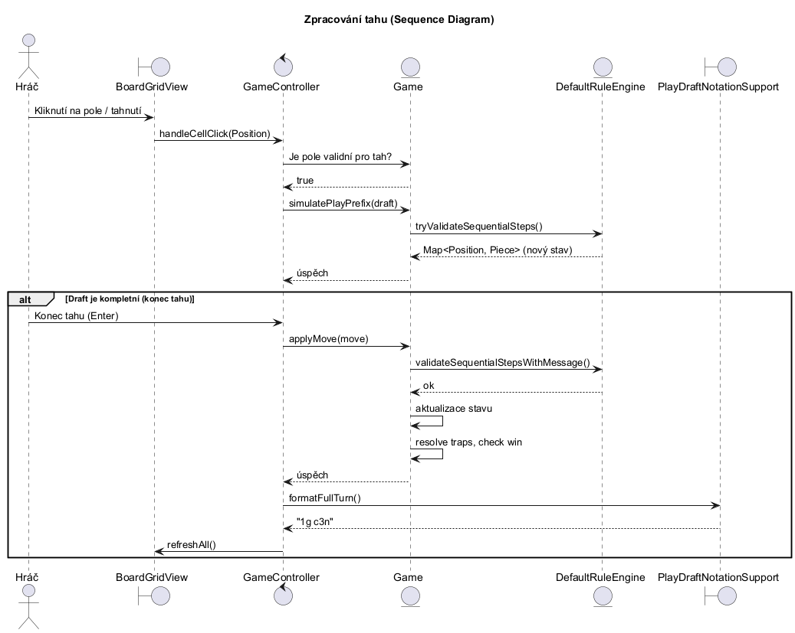
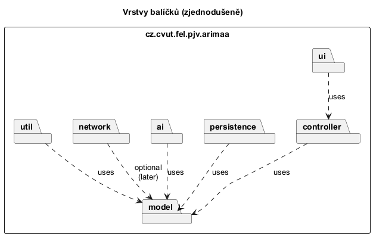
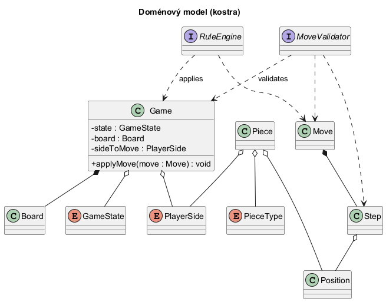
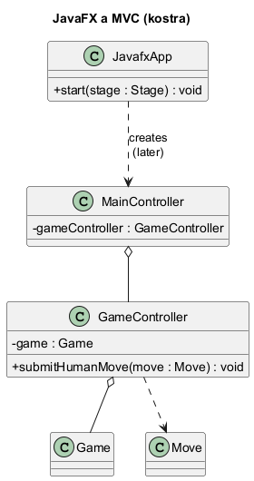
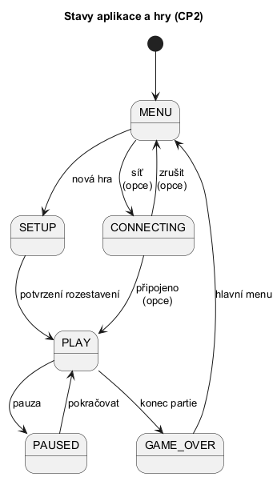
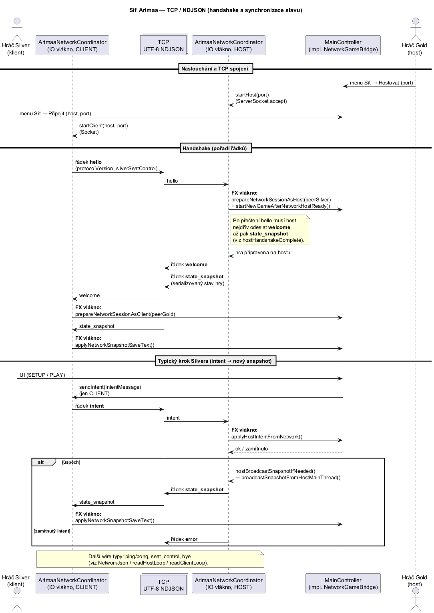

# Technická dokumentace

**Vývojová verze textu:** **0.9.34** (větev `CP3-ext`; číslo v UI z `AppVersion` / git tagu, popis v `Arimaa/pom.xml` a `Arimaa/Changelog.md`).

Tento dokument slouží jako průvodce vnitřní architekturou aplikace Arimaa. Popisuje hlavní koncepty, toky řízení, použitý vizuální framework (JavaFX) a zvolené strategie implementace.

## 1. Úvod a Architektura

Aplikace je navržena s využitím modifikované architektury **MVC (Model-View-Controller)**. 
Cílem bylo maximálně oddělit herní logiku (Model) od grafického rozhraní (View) a zajistit, že doménová pravidla nejsou vázána na konkrétní prezentační technologii.

**Další vrstvy (stručně):** – `Game` funguje jako fasáda modelu vůči pravidlům a historii; – `GameController` ztenčuje volání z UI pro lokální hru; – síť odděluje `ArimaaNetworkCoordinator` (I/O) od domény přes `NetworkGameBridge`; – UI staví programaticky (bez FXML), viz § 3.4 a § 3.6.

### Hlavní koncepty a strategie
- **Reprezentace desky**: vnitřní deska je reprezentována jako dvourozměrné nebo jednorozměrné pole v závislosti na fázi (např. klasický `Board` s dvourozměrnou mřížkou pro UI a `Piece[64]` pro rychlé AI vyhledávání). 
- **Validace tahů**: Arimaa je komplexní hra, protože tah se může skládat až ze 4 kroků. Validace probíhá ve dvou vrstvách - postupná kontrola průběžného "draftu" tahu v GUI a hloubková validace plného tahu v enginu.
- **JavaFX a vlákna**: veškeré změny v uživatelském rozhraní se odehrávají v hlavním vlákně (JavaFX Application Thread). Pro operace náročné na procesor (např. výpočet tahu počítače) nebo blokující I/O (TCP síť) se práce přesouvá na pozadí (`ExecutorService` apod.); zpět na FX thread se výsledky doručují přes `Platform.runLater()` (u sítě např. přes `FxExecutor` s odkazem na `Platform::runLater`).
- **Minimalizace objektových alokací**: v kritických sekcích enginu a AI (např. generování možných tahů) je systém optimalizován na minimum alokací (využívají se primitivní datové typy a přepoužívají se pole objektů místo vytváření nových kolekcí `ArrayList`), to urychluje prohledávání stavového prostoru.

---

## 2. Diagram sekvence: Zpracování tahu

Tento diagram ilustruje interakci mezi uživatelem, UI vrstvou a modelem při provádění tahu. Jde o **zjednodušený** pohled (v produkčním kódu vstupy z desky zpracovává mimo jiné `MainController` / `PlayPhaseUiHandler`, nejen jedna metoda na `GameController`).

Zdroj: [`puml/sequence-move.puml`](puml/sequence-move.puml). Po úpravě souboru je potřeba znovu vygenerovat PNG do `puml/out/` (rozšíření PlantUML, CLI `plantuml`, nebo nástroj z IDE).

### 2.1 Další diagramy ze složky PlantUML

Zdrojové `.puml` soubory leží v [`Dokumentace/puml/`](puml/). Exportované obrázky v [`Dokumentace/puml/out/`](puml/out/) — po změně diagramu je znovu vygenerujte, aby seděly s textem v repozitáři.

**Struktura balíčků (zjednodušeně)**

  
Zdroj: [`puml/package-structure.puml`](puml/package-structure.puml).

**Doménový model (kostra tříd)**

  
Zdroj: [`puml/class-model.puml`](puml/class-model.puml). Rozhraní `RuleEngine` / `MoveValidator` v kódu implementuje zejména `DefaultRuleEngine`.

**JavaFX a MVC (kostra)**

  
Zdroj: [`puml/class-ui.puml`](puml/class-ui.puml). `MainController` dnes drží mnohem více odpovědností (viz § 3.4); diagram zachycuje jen jádrový vztah k `GameController` a `Game`.

**Stavy aplikace (zjednodušeně)**

  
Zdroj: [`puml/state-game.puml`](puml/state-game.puml). Toto **není** přímý výpis enumu `GameState` v modelu (tam jsou např. `SETUP_GOLD` / `SETUP_SILVER`), ale schematická navigace z pohledu uživatele (menu, síť, pauza).

Síťový handshake a synchronizace stavu (`hello` / `welcome` / `state_snapshot` / `intent`) — viz **§ 3.7** a [`puml/sequence-network.puml`](puml/sequence-network.puml).

---

## 3. Rozvržení balíčků a klíčové třídy

Zde je popis balíčků aplikace od vstupního bodu až po specifické subsystémy.

### 3.1. Vstupní bod (`cz.cvut.fel.pjv.arimaa`)
- **`ArimaaApp`**
  - *Charakteristika*: `final` třída se soukromým konstruktorem (jen statický vstup); 
  - *Odpovědnost*: zpracování CLI argumentů pro logování (`LoggingSupport.bootstrapFromArgs`), poté spuštění JavaFX runtime přes `Application.launch(JavafxApp.class, args)`.
- **`JavafxApp`** (`cz.cvut.fel.pjv.arimaa.ui`)
  - *Charakteristika*: jediná třída odvozená od `javafx.application.Application`.
  - *Odpovědnost*: v `start` vytvoří `Game` (včetně `startNewGame`), `GameController` s navázanou hrou a `MainController`, který připojí k primárnímu `Stage`; v `stop` uvolní zdroje související s hodinami v PLAY (`shutdownPlayChessClock` na `MainController`).

### 3.2. Doménový model a pravidla (`cz.cvut.fel.pjv.arimaa.model`)
Tento balíček obsahuje srdce celé hry. Všechny třídy zde jsou izolované a nemají ponětí o existenci JavaFX nebo TCP.

- **`Game`**
  - *Charakteristika*: hlavní fasáda modelu.
  - *Odpovědnost*: drží stav hry (`GameState`), tahy, historii a časovač. Deleguje kontrolu tahů do enginu pravidel.
- **`Board`**
  - *Charakteristika*: objektová reprezentace herního plánu 8x8.
  - *Metody*: `getPiece(Position pos)`, `setPiece(Position pos, Piece piece)`.
- **`DefaultRuleEngine`**
  - *Charakteristika*: implementace oficiálních pravidel Arimaa.
  - *Odpovědnost*: router pro validaci sekvenčních kroků (Slide, Push, Pull). Rozhoduje, zda je tah legální, zpracovává pasti a zmrazení figur.
- **`GridMoveRules`**
  - *Charakteristika*: vysoce optimalizovaný validátor a generátor pro AI na plochém `Piece[64]` poli. 
- Další třídy: `Move` (kompletní tah hráče), `Step` (dílčí krok - posun jedné figury), `Position` (souřadnice), `GameHistory`.

### 3.3. Herní Controller (`cz.cvut.fel.pjv.arimaa.controller`)
- **`GameController`**
  - *Charakteristika*: prostředník mezi GUI a Modelem pro klasickou offline hru.
  - *Odpovědnost*: udržuje referenci na rozehranou `Game` a reaguje na požadavky z UI (např. uživatel chce potvrdit tah, načíst hru nebo požádat AI o tah).

### 3.4. JavaFX: MainController, vzhled a asynchronní práce (`cz.cvut.fel.pjv.arimaa.ui`)

- **`MainController` a rozklad odpovědností:** – orchestruje scénu (menu, postranní panel, deska, notace, stav sítě a PC); – stavbu layoutu a menu provádí `MainWindowLayoutBuilder` (výsledek jako `MainWindowLayoutResult`: postranní panel + `MenuBar`); – logiku fází SETUP vs PLAY oddělují `SetupPhaseUiHandler` a `PlayPhaseUiHandler`; – rozpracovaný tah v PLAY koordinuje `PlayDraftUiCoordinator` spolu s pomocnými třídami kolem notace a mementa (`PlayDraftNotationSupport` apod.).
- **Orientace desky (`BoardViewOrientation`):** – mapování modelových souřadnic na mřížku; – při aktivní síťové hře a vypnuté položce menu „Otáčet desku — hráč na tahu dole“ má **host (Gold)** a **klient (Silver)** každý na svém počítači **lokálně** svou stranu vizuálně dole (bez přenosu orientace po síti); – je-li rotace zapnutá, platí dosavadní pravidlo (SETUP Gold dole, PLAY podle tahujícího, GAME_OVER podle vítěze).
- **Síť — okno a menu (od 0.9.29):** – při aktivní TCP relaci titulek `Hra Arimaa | Server` / `Klient` + `Na tahu: …`; – menu **Síť** zobrazuje **Zrušit čekání na klienta** během čekání hostitele před `welcome`; – po načtení `state_snapshot` klient obnoví zobrazení PLAY hodin (lokální časovač, ne autoritativní přenos čísel po síti).
- **Stylopis (CSS):** – při `attachToStage` se na `Scene` přidá stylesheet `arimaa-menus.css` z classpath (`/cz/cvut/fel/pjv/arimaa/arimaa-menus.css`); – ve vývoji obnovení CSS klávesou F5 přes `DevMenuCssHotReload` (JVM musí mít `-Darimaa.devMenuCssF5=true`; u `mvn javafx:run` je tato volba v `pom.xml` u `javafx-maven-plugin` v `<options>`, ne přes nepřenášené `-Djavafx.jvmArgs`); – po úpravě souboru v `src/main/resources` je potřeba `mvn compile`, aby se kopie dostala do `target/classes`, pak F5 nebo restart. V `arimaa-menus.css` (od 0.9.27): jedna vrstva horizontálního odsazení řádků v popup menu, symetrické přepsání vnitřních paddingů Modena u položek menu.
- **Vlákna a animace tahu PC:** – výpočet tahu počítače běží v `ExecutorService` mimo FX thread; – po návratu se UI aktualizuje přes `Platform.runLater`; – vizualizace kroků jednoho tahu PC používá jeden `Timeline` s kumulativními prodlevami mezi kroky a na konci commit do modelu; – během animace lze časovou osu pozastavit a znovu spustit (ovládání z klávesnice), aniž by se FX thread blokoval výpočtem AI.
- **Draft tahu a síť:** – rozpracovaný tah se synchronizuje s historií a modelem přes pomocné metody a kopie kroků (`PlayDraftNotationSupport`); – při síťové hře se řeší echo hostitele a záznam timeline tak, aby se broadcast neopakoval zbytečně během animace; – callbacky ze síťového vlákna na FX předává `FxExecutor` (v praxi často `Platform::runLater`).
- **Nápověda a WebView:** – dialog „O programu“ (`ui.help`, např. `AboutProgramDialog`) používá `WebView` pro vložené video; – těžší komponenta se vytváří až při otevření dialogu (on-demand), ne při startu aplikace.

### 3.5. Tah počítače a úrovně obtížnosti (`cz.cvut.fel.pjv.arimaa.ai`)
Modul pro výběr celého legálního tahu v PLAY, když je strana přiřazena počítači. **Minimální požadavek zadání** je hra proti počítači s **náhodným** (ne strategickým) výběrem z legálních tahů; **úroveň 0** odpovídá této linii s drobnou heuristikou (viz níže). **Úrovně 1 a 2** jsou rozšíření nad rámec základního zadání — heuristické hodnocení a prohledávání stromu tahů.

**Rozcestník úrovní — `ComputerPlayMove`**

- *Odpovědnost*: podle `PlayerControllerKind` (`COMPUTER_LEVEL_0` … `COMPUTER_LEVEL_2`) zavolá implementaci úrovně a vrátí jeden kompletní legální tah (`Move`).

**Úroveň 0 — `RandomTrapAvoidingMoveChooser`**

- *Charakteristika*: opakovaně náhodně vzorkuje **jeden** kompletní legální tah (`DefaultRuleEngine.sampleRandomLegalCompleteMove`); přednostně bere tah, po kterém vlastní figurka **nepadne do pasti** (náhled přes `DefaultRuleEngine.trapCapturesIfPrefixApplied`); po omezeném počtu pokusů přijme i vzorkovaný tah s pastí, aby výběr vždy skončil.
- *Shrnutí*: chování blízké „náhodnému počítači“ z zadání, s jednoduchým filtrem proti zbytečné ztrátě vlastní figurky.

**Úroveň 1 — `GreedyComputerMove`**

- *Charakteristika*: v časovém rozpočtu (wall-clock, řád jednotek sekund) opakovaně **vzorkuje** legální kompletní tahy (náhodný DFS, ne výčet všech tahů), každý kandidát ohodnotí statickou funkcí **`HeuristicEvaluation`**, vybere nejlepší skóre (při remíze náhodný výběr).
- *Účel*: silnější než čistá náhoda, ale bez prohledávání odezvy soupeře.

**Úroveň 2 — `AlphaBetaComputerMove`**

- *Charakteristika*: **minimax s alfa-beta prořezáváním** přes **celé tahy** (ne jednotlivé kroky); hloubka v plných tazích je omezená (`MAX_DEPTH_FULL_TURNS`), u širokého kořene se hloubka snižuje; běh je omezen časovým stropem (`SearchBudget`), při vypršení se vrací statické ohodnocení. Tahy u uzlu se řadí (`orderMovesForNodeInPlace`), aby se strom více prořezal.
- *Datová vrstva prohledávání*: **`SearchGrid`** a **`SearchSession`** — zjednodušená reprezentace desky vhodná pro rychlé apply/undo během rekurze (odlišná od plného `Game` enginu).

**Pomocné třídy**

- **`CpuMoveSupport`**: po výběru tahu (zejména z úrovně 2) ověří, zda je tah přijatelný pro `Game.applyMove` na **baseline** mementu; pokud kandidát vznikl jen z gridové vrstvy a engine ho odmítne, použije se záložní legální tah z `DefaultRuleEngine` (např. výčet legálních tahů), aby zůstala shoda s oficiálními pravidly.
- **`SearchBudget`**: sdílený vzor časového limitu pro úrovně 1–2, aby výpočet neblokoval worker vlákno příliš dlouho v hustých pozicích.

### 3.6. Uživatelské rozhraní (`cz.cvut.fel.pjv.arimaa.ui`)
Kompletní vizuální část (JavaFX). Návrh nepoužívá FXML, všechny komponenty se dynamicky skládají v Javě.

- **`MainController`**
  - *Charakteristika*: hlavní obrazovka, drží celkový layout (menu, boční panel, status bar, mřížka desky); – podrobněji viz § 3.4 (handlery fází, builder layoutu, timeline PC, draft).
  - *Odpovědnost*: reaguje na kliknutí myši, klávesové zkratky a koordinuje logiku UI; – spouští pozadí pro výpočet tahu PC a propojuje `GameController` s view.
- **`BoardGridView`**
  - *Charakteristika*: grafická reprezentace šachovnice (třída dědí od `GridPane`).
  - *Odpovědnost*: vykresluje čtverce, animuje figurky, přidává SVG textury a řeší hover efekty (např. zelená barva pro možný cíl, oranžová pro tlačení figury).
- **`PlayVictoryMediaSfx`** a **`PlayProceduralSfx`**
  - *Odpovědnost*: modul zvuků a medií; – vítězná MP4 jako průhledný overlay přes `MediaView`; – procedurální zvuky kroků a pastí: PCM buffery se připraví ve statickém inicializátoru třídy `PlayProceduralSfx` při prvním načtení třídy, přehrávání probíhá na dedikovaném jednovláknovém executoru se sdílenou `SourceDataLine` (znovuotevření linky jen při selhání), aby se na Windows předešlo výpadkům při častém otevírání/zavírání audio zařízení.

### 3.7. Síťová hra (`cz.cvut.fel.pjv.arimaa.network`)
Pro hraní mezi dvěma vzdálenými počítači.

**Model autority:** hostitel = **Gold**, klient = **Silver**. Host mutuje kanonický `Game` a po úspěšném intentu / lokálním tahu vysílá `state_snapshot` (`saveText` = serializace jako u uložené partie). Klient po odeslání `intent` nastaví `networkClientAwaitingHostSync` a čeká na snapshot (nebo `error`).

**Diagram sekvence (handshake, intent Silvera, broadcast `state_snapshot`)**

Následující diagram je zjednodušený: skutečné volání probíhá přes `FxExecutor` / JavaFX vlákno (`Platform.runLater`), IO smyčky hostitele a klienta jsou v `readHostLoop` / `readClientLoop`. Zdroj: [`puml/sequence-network.puml`](puml/sequence-network.puml).

- **`ArimaaNetworkCoordinator`**
  - *Charakteristika*: běží v samostatném vlákně a spravuje TCP sokety.
  - *Odpovědnost*: asynchronně přijímá NDJSON zprávy a předává je do modelu přes `NetworkGameBridge` (oddělení síťového I/O od domény a od JavaFX).
  - *Připojení klienta (0.9.34):* `openClientSocketWithRetry` — při `ConnectException` / connect timeout opakuje TCP connect až ~10 s (pauza 0,5 s, timeout pokusu 2 s), aby klient mohl startovat dřív než host dokončí **Hostovat**.
- **`NetworkGameBridge`**
  - *Odpovědnost*: mapuje wire zprávy na operace s `Game` / UI notifikace tak, aby koordinátor nemusel znát detaily ovládacích prvků. Implementace: `MainController`.
  - *Snapshot (0.9.34):* `applyNetworkSnapshotSaveText` při chybě parsování/replay notace obnoví předchozí text (rollback) a **neplánuje** CPU; úspěšný load na klientovi teprve uvolní `networkClientAwaitingHostSync` / `computerActionPending` a volá `scheduleComputerTurnIfNeeded`.
- **`WireMessages` / `IntentKind`**
  - *Charakteristika*: DTO pro NDJSON (Hello, Welcome, StateSnapshot, Intent, Error, Ping/Pong, SeatControl, Bye).
  - *PLAY:* klient posílá mimo jiné `PLAY_ACTIVATE`, `PLAY_END_TURN`, `PLAY_CANCEL_DRAFT`, **`PLAY_SUBMIT_NOTATION`** (celý řádek notace — typicky Silver CPU po animaci). Host u `PLAY_SUBMIT_NOTATION` přijímá i krátké tahy s `... pass` (stejně jako načtení souboru).
- **CPU v síti (0.9.33+):** Gold CPU jen na hostu; Silver CPU jen na klientovi. Host v PLAY **nesmí** točit `scheduleComputerTurn` pro peer Silver. Po odeslání Silver intentu zůstává `computerActionPending` do odpovědi hostitele.
- **Ochrana proti desync UI:** během živé síťové partie host neprochází „Historie tahů“ / Page Up–Down tak, aby vyslal historický pohled; Undo/Redo při běžícím tahu CPU animaci přeruší.
### 3.8. Persistence (`cz.cvut.fel.pjv.arimaa.persistence`)
Třídy pro uložení a načtení stavu hry.

- **`GameSerializer`**
  - *Odpovědnost*: serializuje aktuální stav modelu do textového/NDJSON souboru a provádí zpětnou deserializaci (Load/Save funkce).
- **`PlayNotationParser`**
  - *Odpovědnost*: parsování standardní textové notace tahů (např. "1g c3n").

### 3.9. Logování (`cz.cvut.fel.pjv.arimaa.logging`)
- **`LoggingSupport`**
  - *Charakteristika*: pomocná vrstva nad SLF4J/Logback.
  - *Odpovědnost*: umožňuje z UI (nebo přes CLI / JVM vlastnost) dynamicky měnit úroveň logování (DEBUG, INFO, WARN, …) a připojit `FileAppender` k **zadané cestě** (`--log-file=`, `cz.cvut.fel.pjv.arimaa.log.file`). Bez vlastní cesty se použije výchozí soubor **`arimaa.log`**: je-li z classpath rozpoznatelný kořen modulu Maven (`…/Arimaa` z `target/classes` nebo JAR ve `target/`), zápis jde tam; jinak do **`user.dir`** (obvykle pracovní adresář procesu — při `java -jar` z adresáře s JARem tedy typicky vedle JARu).
