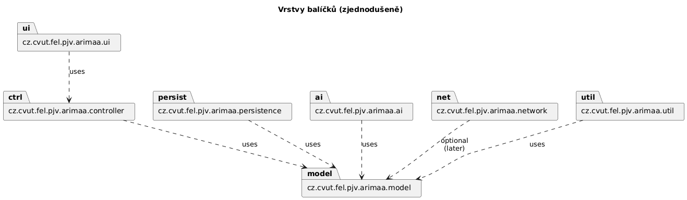
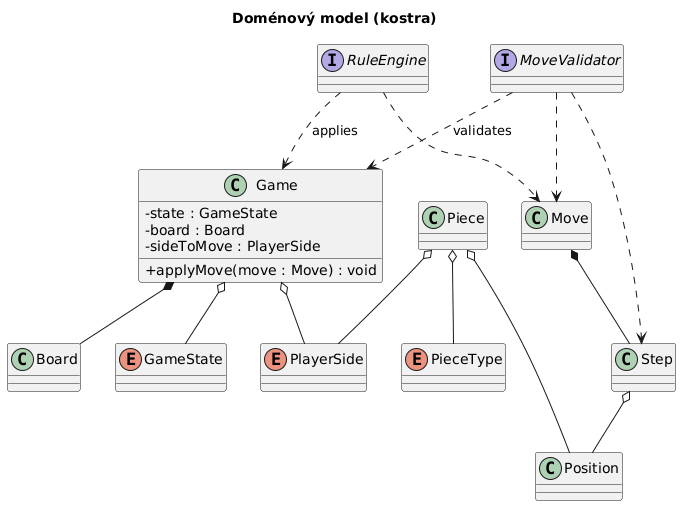
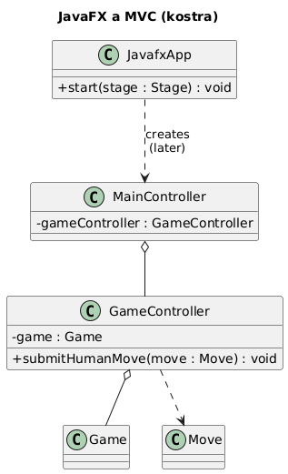
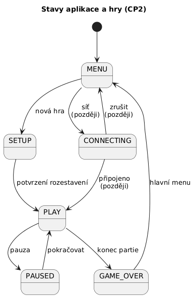

# Semestrální práce B0B36PJV – Arimaa

Desktopová hra **Arimaa** v Javě. Tento repozitář obsahuje **kostru projektu (CP2)** podle schválené vize; herní logika, UI scény a síťová komunikace budou doplněny v dalších iteracích.

## Modul Maven

Zdrojový kód je v adresáři [`Arimaa/`](Arimaa/).

- **Kompilace:** `mvn -f Arimaa/pom.xml compile`
- **Spuštění JavaFX (po doplnění UI):** `mvn -f Arimaa/pom.xml javafx:run`  
  Hlavní třída aplikace: `cz.cvut.fel.pjv.arimaa.ui.JavafxApp`.  
  Vstupní bod `cz.cvut.fel.pjv.arimaa.ArimaaApp` volá `Application.launch`.

## Použité technologie

| Oblast | Technologie |
|--------|-------------|
| Jazyk | Java 21 |
| Build | Maven |
| GUI | JavaFX (controls, FXML připraveno na později) |
| Logování | SLF4J + Logback (`src/main/resources/logback.xml`) |
| Testy (příprava na CP3) | JUnit 5 (závislost v POM, testy zatím nejsou povinné pro CP2) |

## Objektový návrh (MVC)

Aplikace je členěna do vrstev:

- **`model`** – doménový model: `Game`, `Board`, `Piece`, `Position`, `Move` (celý tah až se čtyřmi kroky), `Step` (jeden atomický krok), výčty `GameState`, `PlayerSide`, `PieceType`, rozhraní `MoveValidator` a `RuleEngine` pro validaci a aplikaci tahů.
- **`controller`** – tenká vrstva `GameController` mezi UI a modelem (např. předání lidského tahu).
- **`ui`** – JavaFX: `JavafxApp`, `MainController` (propojení s FXML přijde později).
- **`persistence`** – ukládání a načítání (`GameRepository`, `GameSerializer` / notace).
- **`ai`** – generování tahů a náhodná AI (`MoveGenerator`, `RandomAiPlayer`).
- **`network`** – rozhraní `GameMessage`, `NetworkClient`, `NetworkServer` **bez implementace**; TCP klient–server podle IP a portu bude doplněn později spolu s popisem protokolu pro finální dokumentaci.
- **`util`** – např. konstanty desky (`BoardConstants`).

V CP2 jsou těla metod záměrně prázdná nebo vracejí neutrální hodnoty; nejde o hratelnou hru.

### Diagram balíčků



### Diagram tříd – model



### Diagram tříd – JavaFX a MVC



### Stavový diagram

Stavy zahrnují režim hry na jednom počítači. Stav **`CONNECTING`** je připraven pro budoucí síťovou hru (připojení na IP:port).



## Dokumentace ve formátu PlantUML

Zdrojové soubory diagramů jsou v [`Dokumentace/*.puml`](Dokumentace/). Obrázky v [`Dokumentace/out/`](Dokumentace/out/) lze znovu vygenerovat například:

- nástrojem [PlantUML](https://plantuml.com/) (CLI nebo plugin do IDE), nebo
- službou [Kroki](https://kroki.io/) (HTTP POST těla `.puml` na endpoint `plantuml/png`).

Příklad (PowerShell z kořene repozitáře):

```powershell
Invoke-WebRequest -Uri "https://kroki.io/plantuml/png" -Method Post `
  -Body ([IO.File]::ReadAllText("Dokumentace/class-model.puml")) `
  -ContentType "text/plain; charset=utf-8" `
  -OutFile "Dokumentace/out/class-model.png"
```

## Síťová hra (plán)

Po dokončení základní lokální hry je plánována **jednoduchá komunikace po TCP** (adresa hostitele a číslo portu). Klienti budou posílat serializované zprávy (`GameMessage` a odvozené typy). Detaily protokolu budou popsány v technické dokumentaci u finálního odevzdání (CP3).

## Starší odevzdání

Soubory vize projektu (CP1) zůstávají v kořeni repozitáře (`Vize projektu hra Arimaa.pdf` apod.).
